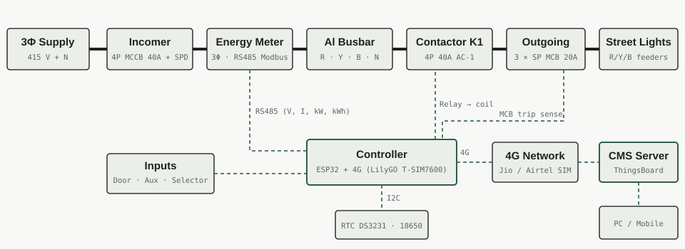

# CMS: Smart Street Light Feeder Panel

3-phase, 10 kW smart feeder control panel for street lights. It talks to a **CMS (Central Monitoring System)** dashboard over 4G/LTE. The panel switches the lights on a schedule or by sunset/sunrise and reads a 3-phase energy meter. It detects lamp, MCB, phase and contactor faults and logs every event, as asked for in the [tender spec](docs/tender-spec.md).

## Repository layout

| Path | What it has |
|---|---|
| [docs/tender-spec.md](docs/tender-spec.md) | Tender requirements (with the original screenshot) and where each is covered |
| [docs/design.md](docs/design.md) | Load calculation, power wiring, control wiring, pin map |
| [docs/logic.md](docs/logic.md) | Operating modes, flowchart, fault detection rules |
| [docs/bom.md](docs/bom.md) | Components list with approximate prices in INR |
| [docs/cms-dashboard.md](docs/cms-dashboard.md) | ThingsBoard server setup, telemetry keys, remote commands |
| [docs/build-and-test.md](docs/build-and-test.md) | Build order, test steps, safety |
| [firmware/street_light_panel/](firmware/street_light_panel/street_light_panel.ino) | ESP32 + 4G controller code (Arduino IDE) |

## Hardware at a glance

- Controller: LilyGO T-SIM7600E (ESP32 + 4G LTE)
- Energy meter: Eastron SDM630-Modbus V2 (RS485)
- Switching: 4P 40 A contactor with an AUTO / OFF / MANUAL selector, so the lights still work if the controller fails
- CMS: ThingsBoard over MQTT

## Status

Design stage. The firmware has not been compiled or tested on hardware yet. Bench-test it first (see [build-and-test.md](docs/build-and-test.md)).

Open questions:
- Number of lamps per panel and their wattage (needed to tune lamp-failure detection)
- Tender build (may need an industrial-grade controller) or self-build
- Own CMS server (ThingsBoard) or the client's existing software
