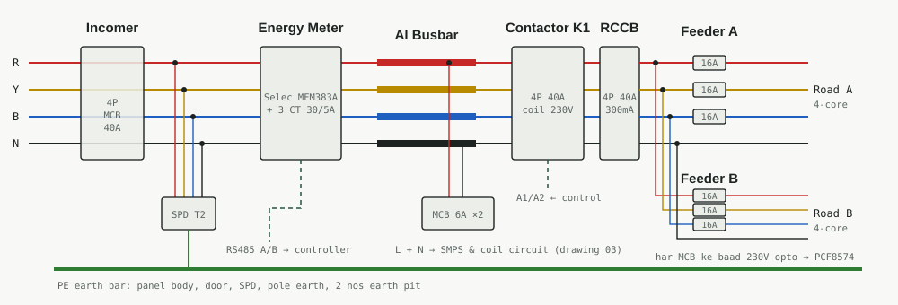
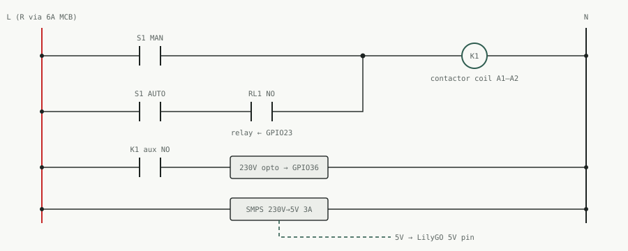

# Panel design

## Load calculation

I = P / (√3 × V × PF) = 10,000 / (1.732 × 415 × 0.95) ≈ **14.6 A per phase**

LED drivers draw a high inrush current, so the incomer and contactor are rated 40 A (about 2.5× margin).

| Item | Value |
|---|---|
| Supply | 415 V, 3-phase + N |
| Connected load | 10 kW |
| Current per phase | ≈ 14.6 A |
| Incomer | 4P MCB 40 A C-curve + Type 2 SPD |
| Contactor | 4P 40 A AC-1, 230 V coil |
| Earth leakage | 4P RCCB 40 A, 300 mA after the contactor |
| Outgoing | 2 three-phase feeders (one per road direction), each with 3 × SP MCB 16 A C-curve |
| Power wiring | 6 sq mm Cu (16/25 sq mm at terminal blocks per spec) |
| Control wiring | 1.5 sq mm Cu |

## Block diagram

## Power wiring

Indian colour code: R red, Y yellow, B blue, neutral black, earth green.

Supply → 4P incomer → SPD (to earth) → energy meter (Selec MFM383A-C, with 3 CTs on R, Y, B) → aluminium busbar → contactor K1 → 4P RCCB 300 mA → two outgoing feeders (A and B, one per road direction), each with 3 SP MCBs and a 4-core cable. A 230 V opto channel after each of the 6 MCBs, read through a PCF8574 expander, tells the controller which MCB has tripped; if all 6 go dead together, the RCCB has tripped.

## Feeder design for 250 poles

- **Two 3-phase feeders, not three single-phase ones.** Each road direction gets a 4-core cable, and lamps are connected R, Y, B, R, Y, B… pole by pole. The phases stay balanced and the voltage drop is about one-sixth of a single-phase feeder of the same load.
- **RCCB 300 mA.** On a 2–3 km feeder, a phase-to-earth fault at the far end does not draw enough current to trip a 16 A MCB. The RCCB clears earth faults anywhere on the feeder. CEA safety regulations also require earth leakage protection above 5 kW.
- **6 A MCB in each pole** (from the spec) protects each lamp tap, so a lamp fault trips only its own pole.
- **Voltage drop.** LED drivers accept roughly 140–270 V, so 5–8% drop is workable, but bigger drop wastes energy. See the cable table in [scale-and-bid.md](scale-and-bid.md); size cables on the real route lengths. Control supply is tapped from the R bus and N through two 6 A MCBs.

## Control wiring

The 3-position selector switch:
- **AUTO**: the coil is fed through relay RL1, driven by the controller (GPIO23).
- **OFF**: lights off.
- **MANUAL**: the coil is fed directly, so the lights can run even if the controller fails.

The contactor aux NO contact feeds a 230 V opto input so the controller knows the contactor really closed.

## Controller pin map (LilyGO T-A7670 / T-SIM7600)

| ESP32 pin | Connected to | Note |
|---|---|---|
| GPIO18 / GPIO19 | TTL-RS485 module TXD / RXD → meter A, B | Auto-direction module, twisted pair, 120 Ω at the end |
| GPIO21 / GPIO22 | DS3231 RTC SDA / SCL | Keeps time without network |
| GPIO23 | Relay module IN → RL1 | Opto-isolated relay |
| GPIO35 | Door limit switch | LOW = door closed, 10k pull-up |
| GPIO36 | Contactor aux NO via 230 V opto | LOW = contactor on, 10k pull-up |
| GPIO21 / GPIO22 (I2C) | PCF8574 expander at 0x20, P0–P5 ← opto after MCBs A-R, A-Y, A-B, B-R, B-Y, B-B | LOW = supply present |
| GPIO15 | Selector AUTO position (extra contact block) | LOW = AUTO |
| 5V / GND | 230 V → 5 V 3 A SMPS | The 4G modem draws up to 2 A peaks |
| SIM / antenna | Nano SIM, 4G antenna mounted outside the panel | Metal enclosures block signal |

The modem uses GPIO26/27 and GPIO4 on both boards, plus GPIO12 (power) on the T-A7670 and GPIO25 on the T-SIM7600. Pins are for these LilyGO boards. Check the pinout of the actual board before wiring. GPIO 34–39 are input-only and have no internal pull-ups.
