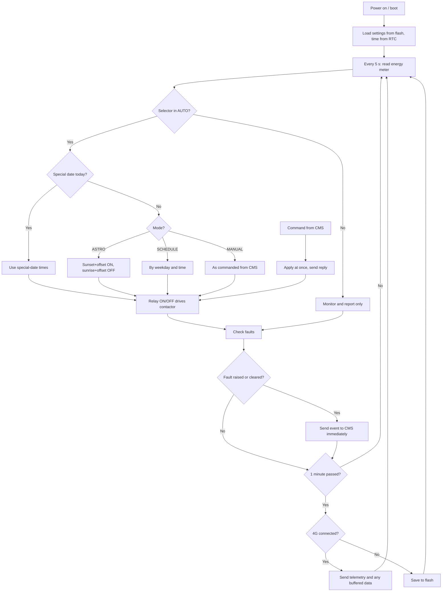

# Working logic

Every 5 seconds the controller reads the meter, decides whether the lights should be on, and checks for faults. Every minute it sends telemetry to the CMS. If the network is down, data is stored in flash (about 1 MB) and sent when the network returns. Switching never depends on the network: the timer runs inside the panel.

## Modes

| Mode | Behaviour |
|---|---|
| **ASTRO** (default) | Computes sunrise and sunset daily from the panel's latitude/longitude. ON at sunset + 10 min, OFF at sunrise − 10 min. Offsets are set from the CMS. |
| **SCHEDULE** | Fixed ON/OFF times (e.g. 18:30 to 06:00) with a day-of-week mask. |
| **MANUAL** | Remote ON/OFF from the dashboard. The MQTT connection stays open, so commands take effect in 1–2 seconds. |
| **Special dates** | Up to 8 dates with their own ON/OFF times (festivals, events). These override ASTRO and SCHEDULE. |

If the selector switch is not in AUTO, the controller only monitors and reports.

## Flowchart

## Fault detection

| Fault | Telemetry key | How it is detected | Severity |
|---|---|---|---|
| Phase fail | `f_phaseR/Y/B` | Phase voltage below 180 V | Critical |
| Over voltage | `f_overVolt` | Any phase above 270 V | Major |
| Over current | `f_overCurrent` | Any phase above 25 A | Major |
| Lamp failure | `f_lampR/Y/B` | 10 min after switching on, phase current below 80% of the learned baseline. Lamps failed ≈ (baseline − current) / current of one lamp. The baseline is learned on the first night or via `learnBaseline`. | Major |
| Outgoing MCB trip | `f_mcbR/Y/B` | Phase voltage present and contactor on, but no 230 V after the MCB | Critical |
| Contactor fault | `f_contactor` | Commanded ON, but no aux feedback or current after 30 s | Critical |
| Day burning | `f_dayBurn` | Commanded OFF, but current flowing for more than 1 min | Major |
| Door open | `f_door` | Door limit switch open | Major |
| Meter / supply fail | `f_meter` | No Modbus reply from the meter. The controller runs on its 18650 cell and still reports. | Critical |
| Network down | — | MQTT disconnected; data buffered in flash | Info |

Each fault change is also sent as an `event` string (`f_lampR RAISED`, `f_lampR CLEARED`) for the event log.
