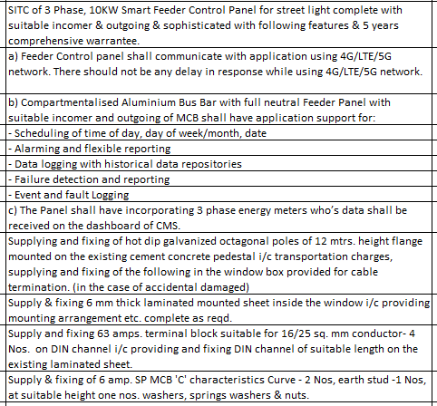

# Tender specification

## Requirements and where they are covered

| # | Requirement (from spec) | Covered in |
|---|---|---|
| 1 | SITC of 3-phase, 10 kW smart feeder control panel for street lights, with incomer, outgoing and 5-year comprehensive warranty | [design.md](design.md), [bom.md](bom.md) |
| a | Panel communicates with the application over 4G/LTE/5G, with no delay in response | 4G modem + persistent MQTT connection, commands applied immediately ([logic.md](logic.md)) |
| b | Compartmentalised aluminium busbar with full neutral, MCB incomer and outgoing | [design.md](design.md) power wiring |
| b1 | Scheduling by time of day, day of week/month, date | ASTRO, SCHEDULE (weekday mask) and special-date modes ([logic.md](logic.md)) |
| b2 | Alarming and flexible reporting | ThingsBoard alarm rules and reports ([cms-dashboard.md](cms-dashboard.md)) |
| b3 | Data logging with historical data repositories | Telemetry every 5 min (configurable) plus instant events, offline buffer in flash, history in ThingsBoard |
| b4 | Failure detection and reporting | Fault table in [logic.md](logic.md) |
| b5 | Event and fault logging | `event` telemetry key, RAISED/CLEARED per fault |
| c | 3-phase energy meter data shown on the CMS dashboard | Selec MFM383A-C (or SDM630) over Modbus RS485 |
| — | 12 m hot-dip galvanised octagonal poles on existing pedestals | Civil/supply item, outside this design |
| — | 6 mm laminated sheet inside the pole window box | Civil/supply item |
| — | 63 A terminal block for 16/25 sq mm conductor, 4 nos, on DIN channel | Per pole, [bom.md](bom.md) note |
| — | 6 A SP MCB C-curve, 2 nos, earth stud, per pole | Per pole, [bom.md](bom.md) note |
